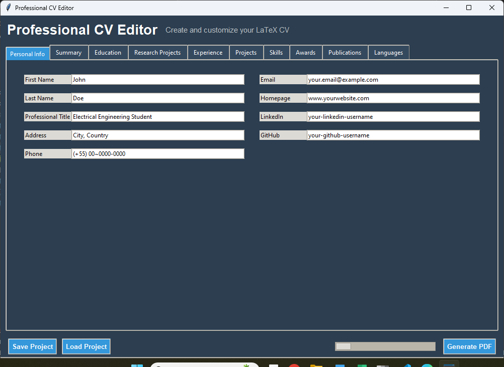

# Professional CV Editor

  
*A modern GUI application for creating professional CVs in LaTeX format*

## Features

-  **Easy-to-use interface** with tabbed sections
-  **ModernCV template** with classic style and blue color scheme
-  **Section toggles** to include/exclude content
-  **Real-time LaTeX generation** with XeLaTeX compilation
-  **Save/Load projects** in custom `.cvproj` format
-  **Export to PDF** with one click
-  **Tooltips and guidance** for each field
-  **Multi-platform support** (Windows, Linux, macOS)

## Requirements

- Python 3.8+
- MikTeX (Windows) or TeX Live (Linux/macOS)
- Python packages:
  ```
  tkinter
  ```

## Installation

1. **Install Python** from [python.org](https://www.python.org/downloads/)
2. **Install LaTeX distribution**:
   - Windows: [MikTeX](https://miktex.org/download)
   - Linux: `sudo apt install texlive-xetex` (Debian/Ubuntu)
   - macOS: `brew install --cask mactex`
3. **Clone this repository**:
   ```
   git clone https://github.com/Jakson-Almeida/latex-cv-editor.git
   cd latex-cv-editor
   ```

## Usage

1. Run the application:
   ```
   python app.py
   ```
2. Fill in your personal information
3. Edit each section with your content
4. Toggle sections using the checkboxes
5. Generate PDF:
   - Click "Generate PDF" button
   - First run may take longer as MikTeX installs required packages

## Customization

### Modify Template
Edit `templates/cv_template.tex` to change:
- Document class options
- Color scheme
- Font settings
- Section formatting

### Add New Sections
1. Add section to `section_order` in `generate_pdf()` method
2. Create corresponding tab in the interface

## Troubleshooting

### Common Issues

**"XeLaTeX not found" error**  
- Ensure MikTeX is installed and added to PATH
- Restart your computer after installation

**Missing packages during compilation**  
- Run MikTeX Console as Administrator
- Enable "Always install missing packages on-the-fly"

**Font Awesome conflicts**  
- Update all packages in MikTeX Console
- Delete temporary `.aux` files

## Project Structure

```
latex-cv-editor/
├── app.py                # Main application entry point
├── controller.py         # Application logic
├── model.py              # Data handling and LaTeX generation
├── view.py               # User interface components
└── templates/
    └── cv_template.tex   # LaTeX template file
```

## Contributing

1. Fork the repository
2. Create a new branch (`git checkout -b feature/your-feature`)
3. Commit your changes (`git commit -am 'Add some feature'`)
4. Push to the branch (`git push origin feature/your-feature`)
5. Open a Pull Request

## License

MIT License - see [LICENSE](LICENSE) file for details

---

For support or feature requests, please open an issue on GitHub.
